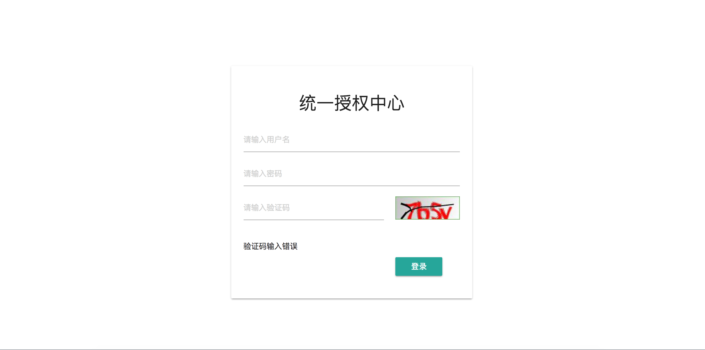

<!-- TOC -->

- [实际需求](#实际需求)
- [实现思路](#实现思路)
    - [关于验证码](#关于验证码)
    - [用Spring Security实现的思路](#用spring-security实现的思路)
- [具体实现](#具体实现)

<!-- /TOC -->


# 实际需求
 
一般情况下网站提供的用户登录的界面中除了让用户输入用户名和密码还需要输入随机验证码，来进行人机校验。Spring Security 提供了一个UsernamePasswordAuthenticationFilter的过滤器作为默认的用户登录过滤器，但是只能对用户名和密码进行校验。我们需要实现当用户登录对的时候都必须输入验证码，如果验证码没有通过校验会提示验证码输入有误，当验证码被校验后才进行用户和密码的校验。

# 实现思路

## 关于验证码
我们可以通过kaptcha的库来生成验证码，当用户打开登录界面的时候就可以请求到该验证码的图片，然后服务端将验证码的随机值保存在session中，当用户登录的时候先校验用户提交表单中验证码的值和保存在session中的值是否相当，如果相等进一步验证用户名和密码。

## 用Spring Security实现的思路
Spring Security默认是提供一个formLogin的功能的，当没有认证（未登录）的用户访问受保护的资源的时候，会跳转到登录界面，该formLogin是通过UsernamePasswordAuthenticationFilter实现的，所以我们需要替换掉UsernamePasswordAuthenticationFilter然后自定义一个过滤器来处理具有证码校验的功能。

# 具体实现

> 说明：该演示项目是基于Spring boot的，所以所有Bean的配置都是使用Java Configuration的方式实现的，没有使用XML配置

1. 创建一个SecurityConfiguration的类，并继承SpringSecurity提供的WebSecurityConfigureAdapter类，Spring Security的配置核心就在该类中。
2. 在SecurityConfiguration中重写 `protected void configure(AuthenticationManagerBuilder auth)`方法，加入测试用户名和密码，如下：

``` java
 @Override
    protected void configure(AuthenticationManagerBuilder auth) throws Exception {

        auth.inMemoryAuthentication()
                .withUser("admin")
                .password("admin")
                .roles("ADMINN")
             .and()
                .withUser("user")
                .password("user")
                .roles("USER");
    }
```
      
3. 重写` protected void configure(HttpSecurity http)`方法进行核心配置，如下：

``` java
 @Override
    protected void configure(HttpSecurity http) throws Exception {

        http
                .addFilterBefore(loginAuthenticationFilter(), UsernamePasswordAuthenticationFilter.class)
                .exceptionHandling()
                    .authenticationEntryPoint(loginUrlAuthenticationEntryPoint())  //使用新的登录EntryPoint
                .and()
                    .authorizeRequests()
                        .antMatchers("/login","/authentication","/randCode").permitAll() //可以直接访问
                        .anyRequest().authenticated() //任何请求都必须经过授权
                .and()
                    .logout()
                        .clearAuthentication(true)
                        .logoutUrl("/logout")
                        .logoutRequestMatcher(new AntPathRequestMatcher("/logout","GET"))
                        .invalidateHttpSession(true);
                       // .logoutSuccessUrl("/login?logout"); //默认为/login?logout

    }
```
  * 在 `UsernamePasswordAuthenticationFilter`过滤器之前添加了一个LoginAuthenticationFilter，`LoginAuthenticationFilter`的具体实现见步骤6
  
  * 使用`LoginUrlAuthenticationEntryPoint`作为`AuthenticationEntryPoint`，`LoginUrlAuthenticationEntryPoint`的具体实现先步骤7
  

4. `kaptcha`生成验证码的配置


  ```xml

        <dependency>
			<groupId>com.github.axet</groupId>
			<artifactId>kaptcha</artifactId>
			<version>0.0.9</version>
		</dependency>

 ```

在maven中引入kaotcha的依赖,并在Spring Security中声明kaptcha的配置Bean

 ``` java

     /*声明验证码生成策略属性 Bean*/
            @Bean
            public DefaultKaptcha captchaProducer(){
                DefaultKaptcha captchaProducer =new DefaultKaptcha();
                Properties properties =new Properties();
                properties.setProperty("kaptcha.border","yes");
                properties.setProperty("kaptcha.border.color","105,179,90");
                properties.setProperty("kaptcha.textproducer.font.color","red");
                properties.setProperty("kaptcha.image.width","125");
                properties.setProperty("kaptcha.image.height","45");
                properties.setProperty("kaptcha.textproducer.font.size","45");
                properties.setProperty("kaptcha.session.key","code");
                properties.setProperty("kaptcha.textproducer.char.length","4");
                properties.setProperty("kaptcha.textproducer.font.names","宋体,楷体,微软雅黑");
                Config config=new Config(properties);
                captchaProducer.setConfig(config);
                return  captchaProducer;
            }
```

5. 在Controller中是实现验证码的请求处理

 ``` java

    /**
     * 生成验证码
     */
    @RequestMapping(value = "/randCode")
    public void getRandCode(HttpServletRequest request, HttpServletResponse response){

        HttpSession session = request.getSession();


        response.setDateHeader("Expires", 0);

        // Set standard HTTP/1.1 no-cache headers.
        response.setHeader("Cache-Control", "no-store, no-cache, must-revalidate");

        // Set IE extended HTTP/1.1 no-cache headers (use addHeader).
        response.addHeader("Cache-Control", "post-check=0, pre-check=0");

        // Set standard HTTP/1.0 no-cache header.
        response.setHeader("Pragma", "no-cache");

        // 设置返回文件类型
        response.setContentType("image/jpeg");

        // 获取验证码上的文字
        String capText = captchaProducer.createText();

        // 将验证码上的文字保存在session中
        session.setAttribute(Constants.KAPTCHA_SESSION_KEY, capText);

        String code = (String)session.getAttribute(Constants.KAPTCHA_SESSION_KEY);

        logger.info("验证码为:"+code);

        //  将文件渲染到图片上
        BufferedImage bi = captchaProducer.createImage(capText);
        ServletOutputStream out = null;
        try {
            out = response.getOutputStream();
            ImageIO.write(bi, "jpeg", out);
            out.flush();
        } catch (IOException e) {
            e.printStackTrace();
        }


    }

 ```

访问`/randCode`路由是就会得到验证码，并且将验证码上的text写入到session中

6. 自定义LoginAuthenticationFilter

创建一个LoginAuthenticationFilter的类并继承`UsernamePasswordAuthenticationFilter`

``` java

/**
 * 继承 UsernamePasswordAuthenticationFilter 实现自定义登录
 * 使用LoginAuthenticationFilter替换原有的用户名密码认证凡是，需要删除http.formLogin，因为http.formLogin会创建一个LoginAuthenticationFilter
 */
public class LoginAuthenticationFilter extends UsernamePasswordAuthenticationFilter {

    private static  final Logger logger=Logger.getLogger(LoginAuthenticationFilter.class.getName());

    public LoginAuthenticationFilter() {
    }

    @Override
    public Authentication attemptAuthentication(HttpServletRequest request, HttpServletResponse response) throws AuthenticationException {

        //获取表单提交的验证码的值
        String verification = request.getParameter("code");
        //获取下发的存在session中的验证码的值
        String captcha = (String) request.getSession().getAttribute(Constants.KAPTCHA_SESSION_KEY);

        if (captcha==null){
            throw new CaptchaException("验证码不为空");
        }
        else  if (!captcha.contentEquals(verification)) {
            throw new CaptchaException("验证码不匹配");
        }
        //调用UsernamePasswordAuthenticationFilter的认证方法
        return super.attemptAuthentication(request, response);
    }
}


```
先验证登录表单中不含有验证码，或者传入的和session中的不匹配将会抛出`CaptchaException`异常。为了让该过滤器加入到过滤器链中应该先声明该Bean

``` java

 /*声明LoginAuthenticationFilter Bean*/
    @Bean
    public LoginAuthenticationFilter loginAuthenticationFilter() throws Exception {
        LoginAuthenticationFilter loginAuthenticationFilter=new LoginAuthenticationFilter();
        loginAuthenticationFilter.setAuthenticationManager(authenticationManagerBean());
        loginAuthenticationFilter.setFilterProcessesUrl("/authentication");
        loginAuthenticationFilter.setAuthenticationSuccessHandler(new SavedRequestAwareAuthenticationSuccessHandler());
        loginAuthenticationFilter.setAuthenticationFailureHandler(authenticationFailureHandler());
        return loginAuthenticationFilter;
    }

```

其中`authenticationFailureHandler()`是授权异常处理Bean，其具体实现如下：

``` java

 /*声明授权失败异常处理 Bean*/
    @Bean
    public AuthenticationFailureHandler authenticationFailureHandler() {
        //根据抛出的不同的异常跳转到不同的URL
        ExceptionMappingAuthenticationFailureHandler failureHandler = new ExceptionMappingAuthenticationFailureHandler();
        Map<String, String> failureUrlMap = new HashMap<>();
        failureUrlMap.put(BadCredentialsException.class.getName(), LoginAuthenticationFailureHandler.PASS_ERROR_URL);
        failureUrlMap.put(CaptchaException.class.getName(), LoginAuthenticationFailureHandler.CODE_ERROR_URL);
        failureUrlMap.put(AccountExpiredException.class.getName(), LoginAuthenticationFailureHandler.EXPIRED_URL);
        failureUrlMap.put(LockedException.class.getName(), LoginAuthenticationFailureHandler.LOCKED_URL);
        failureUrlMap.put(DisabledException.class.getName(), LoginAuthenticationFailureHandler.DISABLED_URL);
        failureHandler.setExceptionMappings(failureUrlMap);
        return failureHandler;
    }

```

`ExceptionMappingAuthenticationFailureHandler`可以捕捉到任何授权，并跳转到相应的URL。

最后，将`loginAuthenticationFilter` 过滤器添加到`UsernamePasswordAuthenticationFilter`之前。


7. `LoginUrlAuthenticationEntryPoint`的实现

``` java

  /*声明登录endpoint Bean*/
    @Bean
    public LoginUrlAuthenticationEntryPoint loginUrlAuthenticationEntryPoint(){
        LoginUrlAuthenticationEntryPoint loginUrlAuthenticationEntryPoint=new LoginUrlAuthenticationEntryPoint("/login");
        return loginUrlAuthenticationEntryPoint;
    }

```
当访问未登录的用户访问就会跳转到`/login`页面

8. 登出操作

``` java

 .logout()
     .clearAuthentication(true)
     .logoutUrl("/logout")
     .logoutRequestMatcher(new AntPathRequestMatcher("/logout","GET"))
     .invalidateHttpSession(true);
     // .logoutSuccessUrl("/login?logout"); //默认为/login?logout

```
其中因为设置了CSRF保护,所以登录应该使用POST请求，但是示例中使用了GET请求，通过配置` logoutRequestMatcher`可以使用GET来请求`/logout`

9. 前端页面处理

> 本演示示例使用Thymeleaf做为模板引擎

``` html

<div class="container">
	<div class="row">
		<div class="col s6 offset-s3">
			<div class="card card-panel">

				<h4 class="center-align">统一授权中心</h4>
				<form  method="post" th:action="@{/authentication}">
					<div class="uk-form-row">
						<input class="uk-width-1-1 uk-form-large" type="text" placeholder="请输入用户名" name="username"/>
					</div>

					<div class="uk-form-row">
						<input class="uk-width-1-1 uk-form-large" type="password" placeholder="请输入密码" name="password"/>
					</div>

					<!--验证码-->
					<div class="row">
						<div class="col s8"><input type="text" name="code" placeholder="请输入验证码"></div>
						<div class="col s3"></div>
					</div>

					<p class="uk-text-danger" th:if="${param.code_error}">
						验证码输入错误
					</p>

					<p class="uk-text-danger" th:if="${param.pass_error}">
						用户名或密码错误
					</p>

					<p class="uk-text-success" th:if="${param.logout}">
						已登出
					</p>

					<div class="row">
						<div class="s4 col offset-s8">
							<button class="btn btn-block">登录</button>
						</div>
					</div>
				</form>
			</div>
		</div>
	</div>
</div>

```

10. 示例代码
 * [github](https://github.com/liuyatao/spring_security_verifycode 'github')
 * [码云](http://git.oschina.net/liuyatao1992/spring_security_verifycode)
 
11. 效果图



 

